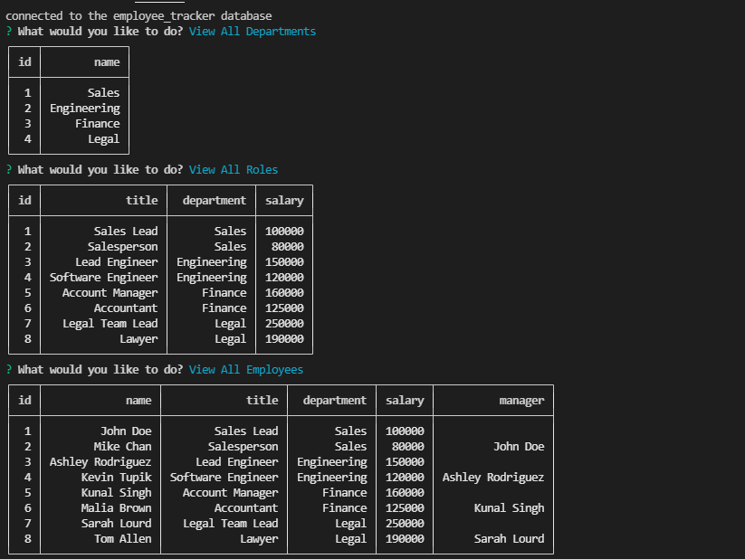

# 12 SQL: Employee Tracker

## Objective

Build a command-line application from scratch to manage a company's employee database, using Node.js, Inquirer, and MySQL.

## Criteria for Project

* When the application starts, the user is prompted with the following options: view all departments, view all roles, view all employees, add a department, add a role, add an employee and update employee role.
* When view all departments is selected, a table is shown with department names and ids
* When view all roles is selected, a table is shown with job title, role id, department role belongs to, and the salary for that role
* When view all employees is selected, a table is shown with id, first and last names, job title, department, salary, and manager
* The program also allows users to add a department, a role (with job title, salary, and department), and/or an employee (with first name, last name, job title, and manager)
* User can also update the job title for any employee
* Bonus - delete department, role and employees

## Built with

* Javascript
* Node JS
* Inquirer
* SQL
* Console Table Printer

## Installation

* Install npm modules and enter npm start to begin server.

## Links
   
🙈 [Link to Demonstration Video](https://watch.screencastify.com/v/4Cc1k1ZOcJAU2326erST)\
🙉 [Repo](https://github.com/RPB543/employee-tracker-rpb)\
🙊 [Github](https://github.com/RPB543)

## Screenshot

